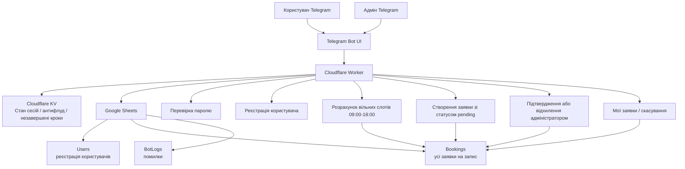

# Архітектура бота запису на стрижку

## Основна логіка

1. Користувач запускає бота.
2. Якщо він не зареєстрований — вводить пароль.
3. Після цього проходить коротку реєстрацію: ім'я та телефон.
4. Користувач обирає дату.
5. Бот показує лише вільні слоти з 09:00 до 18:00.
6. Після вибору часу створюється заявка зі статусом `Очікує підтвердження`.
7. Адмін у Telegram може:
   - підтвердити заявку;
   - відхилити заявку.
8. До підтвердження заявка не вважається активною послугою, але слот уже не показується іншим.
9. Користувач у розділі **Мої заявки** бачить свій статус.
10. Користувач може скасувати заявку, якщо вона ще `Очікує підтвердження` або вже `Підтверджено`.

## Таблиці Google Sheets

### Users
- telegram_id
- username
- full_name
- phone
- registered_at
- last_login_at
- is_registered

### Bookings
- booking_id
- created_at
- updated_at
- telegram_id
- username
- full_name
- phone
- booking_date
- booking_time
- slot_key
- comment
- status
- admin_action_by
- approved_at
- rejected_at
- cancelled_at
- cancelled_by

### BotLogs
- created_at
- level
- scope
- message
- details
